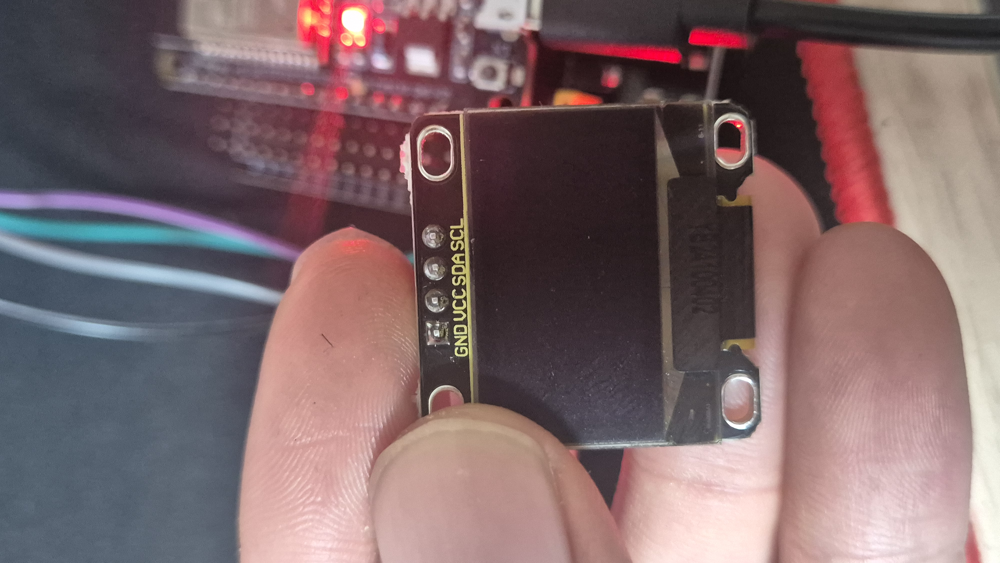
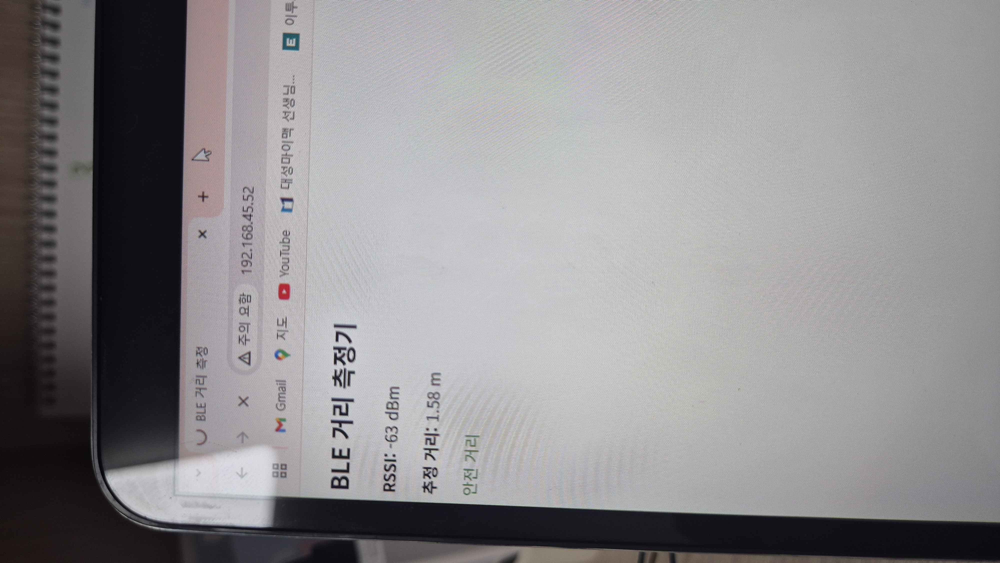
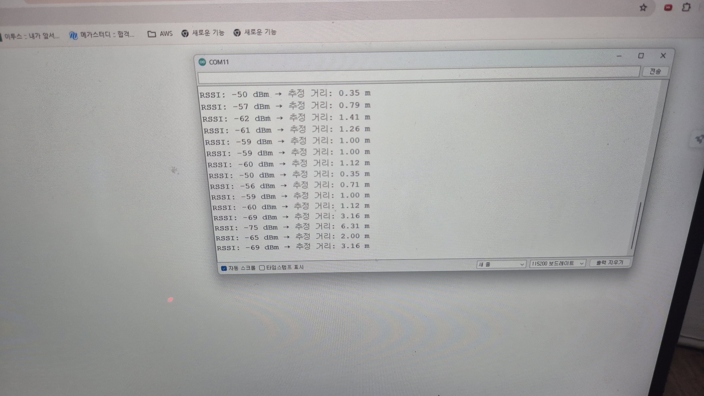

# IoT25-HW07

## Working Image

## Distance Estimation System
[Video](https://youtube.com/shorts/4B_i83bB9m0)

## Project Description
This project implements a BLE-based distance estimation system using two ESP32 devices.
The client measures RSSI values from the server and applies a path-loss model to estimate distance.
Results are visualized through tables and charts comparing actual and estimated distances.
